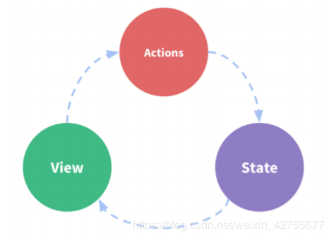

## 单向数据流和双向数据流

### 单向数据流 
  
数据流，表明的是数据流向，用大白话说就是数据传递。那么单项数据流
是我们的数据单一方向传输。对于 Vue 来说，组件之间的数据传递具有单向数据流这样的特性。

首先对于父子组件来说，父组件总是通过 Props 向子组件传递数据。
```
<div id="app"> 
    <show-title></show-title> 
</div> 
<script>
    Vue.component('showTitle', {
        template: '<div>{{ title }}</div>',
        props: ['title']
    })
    new Vue({
        el: '#app',
        data: {
            title: 'Hello Vue'
        }
    })
</script>

```
`props` 的更新会向下流动到子组件中，但是反过来则不行。这样会防止从子组件意外改变父级组件的状态，从而导致你的应用的数据流向难以理解。

每次父级组件发生更新时，子组件中所有的 prop 都将会刷新为最新的值。这意味着你不应该在一个子组件内部改变 prop。如果你这样做了，Vue 会在浏览器的控制台中发出警告。

如果你想在子组件对props传来的数据进行操作，最好再定义一个本地的data属性作为prop的初始值


--- 

### 双向数据绑定
当我们在前端开发中采用 MV*的模式时，M - model，指的是模型，也就是数据，V - view，指的是视图，也就是页面展现的部分。通常，我们需要编写代码，将从服务器获取的数据进行“渲染”，展现到视图上。每当数据有变更时，我们会再次进行渲染，从而更新视图，使得视图与数据保持一致。也就是：

  

而另一方面，页面也会通过用户的交互，产生状态、数据的变化，这个时候，我们则编写代码，将视图对数据的更新同步到数据，以致于同步到后台服务器。也就是：  

  
```
<div id="app"> 
    <input type="text" v-model="title"> 
</div> 
 
<script>
    new Vue({
        el: '#app',
        data: {
            title: 'Hello Vue'
        }
    })
</script>
```
页面上 input 元素对应的位置会显示上面代码中给出的初始值：Hello Vue。

由于双向数据绑定已经建立，因此：

执行 vm.title = ‘vue’ 后，页面上 input 也会更新为显示： vue 在页面文本框中修改内容为：Javascript，则通过 vm.title 获取的值为：
“JavaScript”

--- 

### 单向数据流与双向数据绑定的联系与区别
* 对于非 UI 控件来说，不存在双向，只有单向。只有 UI 控件才有双向的问题.
* 对于复杂应用来说这是实施统一的状态管理（如 Vuex）的前提。双向绑定在一些需要实时反应用户输入的场合会非常方便（比如表单提交）。但通常认为复杂应用中这种便利比不上引入状态管理带来的优势。

---

### 优缺点

单向数据流优缺点

优点：
* 所有状态的改变可记录，可跟踪，容易溯源
* 所有数据只有一份，组件数据只有唯一的入口的出口，使得程序更直观更容易理解。
* 一旦数据变化，就更新页面（data-页面），但是没有（页面-data）
* 如果用户在页面上做了变动，那么就手动收集起来（双向是自动的），合并到数据中

缺点：
* HTML代码渲染完成，无法改变，有新数据，就需把旧HTML代码去掉，整合数据重新渲染
* 代码量提升
* 同时由于对应用状态独立管理的严格要求(单一的全局 store)，在处理局部状态较多的场景时(如用户输入交互较多的“富表单型”应用)，会显得啰嗦及繁琐。


双向数据流优缺点

优点：
* 用户在视图上的修改会自动同步到数据模型中去，数据模型中值的变化也会立刻同步到视图中去；
* 无需进行和单向数据绑定的那些相关操作；
* 在表单交互较多的场景下，会简化大量业务无关的代码。

缺点： 

* 无法追踪局部状态的变化；
* “暗箱操作”，增加了出错时 debug 的难度；
* 由于组件数据变化来源入口变得可能不止一个，数据流转方向易紊乱，若再缺乏“管制”手段，血崩。
