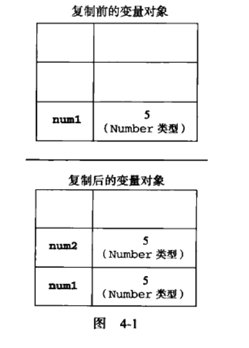
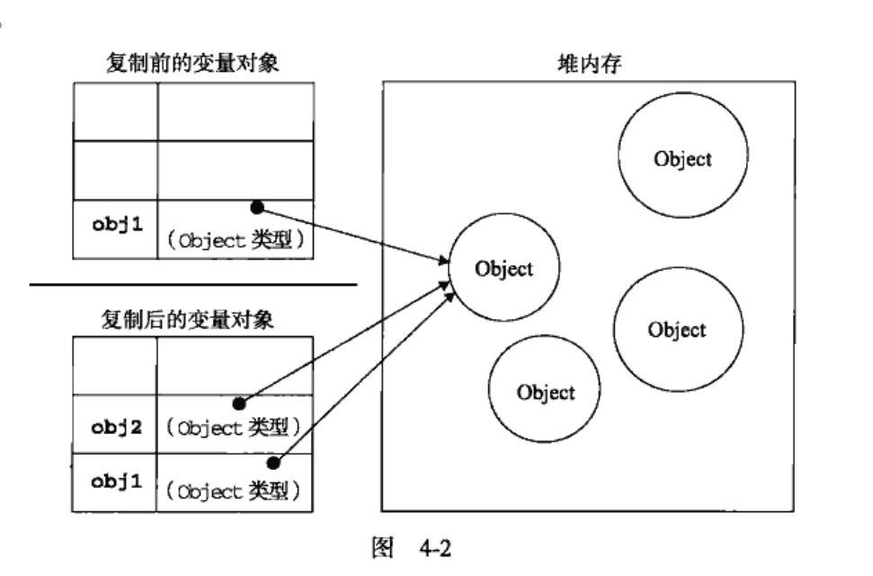

## 4.1基本类型和引用类型的值
#### ECMAScript变量可能包含两种不同数据类型的值。基本数据类型和引用数据类型。基本类型指的是简单的数据段，而引用类型值指那些可能有多个值构成的对象。  
#### 在将一个值赋给变量时，解析器必须确定这个值是基本类型值还是引用类型值。在第三章我们知道基本数据类型：Undefined，null，boolean，Number和String。这5种基本数据类型是按值访问的，因为可以操作保存在变量中的实际的值。  

#### 引用类型的值是保存在内存中的对象，与其他语言不通，js不允许直接访问内存中的位置。也就是说不能直接操作对象的内存空间。在操作对象时。实际上是在操作对象的引用而不是实际的对象。为此。引用类型的值是按引用访问的。

---

### 4.1.1动态的属性
#### 定义基本类型值和引用类型值得方式是类似的。创建一个变量并为该变量赋值。但是，当这个值保存到变量中以后。对不同类型值可以执行的操作则大相径庭。对于引用类型的值，我们可以为其添加属性和方法，也可以改变和删除其属性和方法。
```
var person = new Object();
person.name = "Nicholas";
alert(person.name); //"Nicholas"
```
#### 以上代码创建一个对象并将其保存宰了变量person中。然后。我们为该对象添加了一个名为name的属性。并将字符串值“Nicholas”赋给这个属性。紧接着，又通过alert（）访问这个新属性。如果对象不被销毁。这个属性不被删除。则这个属性将一直存在。
#### `但是，我们不能给基本类型的值添加属性，尽管这样做不会导致任何错误。`
```
var name = "Nicholas";
name.age = 27;
alert(name.age);    //undefined
```
#### 在这个栗子中。我们为字符串name定义了一个名为age的属性。并未该属性赋值27。但在下一行访问这个属性时。发现属性不见了。这说明只能给引用类型值动态的添加属性。以便于将来使用。

---

### 4.1.2复制变量值
除了保存的方式不同之外。在从一个变量到另一个变量赋值基本类型值和引用类型值时候，也存在不同。如果从一个变量向另一个变量赋值基本类型的值。会在变量对象上创建一个新值。然后把该值赋值到新变量分配的位置上。
```
var num1 = 5;
var num2 = num1;
```
#### 在这里 num1保存的值是5,当使用num1的值来初始化num2时，num2中也保存了5.但是num2中的5和num1中的5是完全独立的。该值只是num1中5的一个副本。此后，这两个变量可以参与任何操作而不会互相影响。


#### 当从一个变量向另一个变量复制引用类型的值的时候。同样会将存储在变量对象中的值赋值一份到新变量分配的空间中。不同的是，这个值得副本实际上是一个`指针`，而这个指针指向存储在堆中的一个对象，复制操作结束后，两个变量实际上将引用用一个对象。因此，改变其中一个变量。另外一个就会受到影响。

```
var obj1 = new object();
var obj2 = obj1;
obj1.name = "Nicholas";
alert(obj2.name);   //'Nicholas'
```
#### 首先。变量obj1保存了一个对象的新实例。然后这个值被复制到了obj2中。换句话说。obj1和obj2都指向同一个对象。这样，当为obj1添加name属性后。可以通过obj2来访问这个属性。因为这两个变量都引用了同一个对象。

----

### 4.1.3传递参数
#### ECMAScript中所有函数的参数都是按值传递的。也就是说，把函数外部的值赋值给函数内部的参数，就和把值从一个变量赋值到另一个变量一样。基本类型值得传递如果基本类型变量的复制一样，而引用类型值得传递，则如果引用类型变量的复制一样。
#### 在向参数传递基本类型的值时，被传递的值会被复制给一个局部变量。（即命名参数，或者用ECMAScript的概念来说，就是arguments对象中的一个元素）在向参数传递引用类型的值时,会把这个值在内存中的地址复制给一个局部变量.因此这个局部变量的变量会反应在函数的外部。
#### 栗子
```
function addTen(num){
    num += 10;
    return num;
}
var count = 20;
var result = addTen(count);
alert(count);   //20
alert(result);  //30
```
#### 这里的函数 addTen()有一个参数num，而参数实际上是函数的局部变量。在调用这个函数时，变量count作为参数被传递给函数。这个变量的值是20.于是，数值20被复制给参数num以便于addTen（）中使用。在函数内部，参数num的值被加上了10.但这一变化不会影响函数外部的count变量。参数num与变量count互不认识。他们仅仅是具有相同的值。假如num是按引用传递的话。那么变量count的值也将变成30。从而反映函数内部的修改。
```
function setName(obj){
    obj.name = "Nicholas";
}
var person = new Object();
setName(person);
alert(person.name);     //"Nicholas"
```
#### 以上代码中创建对象，并将其保存在变量person中。然后，这个对象被传递到setName()函数中之后就被复制给了obj。在这个函数内部，obj和person引用的是同一个对象。换句话说。即使这个对象时按值传递的。obj也会按引用来访问同一个对象。于是，当在函数内部为obj添加name属性后。函数外部的person也将有所反映。因为person指向的对象也在堆内存中只有一个。而且是全局对象。
```
栗子：
function setName(obj){
    obj.name = "Nicholas";
    obj = new Object();
    obj.name = "Greg";
}
var person = new Object();
setName(person);
alert(person.name);     //"Nicholas"
```
#### 这个例子与之前一个例子的唯一区别，就是再SetName()函数中添加了两行代码：一行代码为obj重新定义了一个对象，另一行代码为该对象定义了一个带有不同值的name属性。在把person传递给setName()后，其name属性被设置为“Nicholas”。然后。又将一个新对象赋给变量obj。同时将其name属性设置为“Greg”，如果person是按引用传递的。那么person会自动修改为指向其name属性值为“Greg”的新对象。但是，当接下来再访问person.name时，显示的值仍为“Nicholas”。这说明即使再函数内部修改了参数的值。但原始的引用仍然保持未变。实际上，当在函数内部重写obj时。这个变量引用就是一个局部对象了。而这个局部对象会在函数执行完毕立即被销毁。
#### `也就是说当函数内部重写对象obj的时候，这个变量引用就变成一个局部对象。这个局部对象在执行完的时候会立即销毁`


---- 

### 4.1.4检测类型
#### 要检测一个变量是不是基本数据类型？第三章介绍的typeof操作符是最佳的工具.说的更具体一点。typeof操作符是确定一个变量是字符串，数值，布尔值还是undefined的最佳工具。如果变量的值是一个对象或者null，则typeof操作符会像下面栗子一样返回“object”。
```
var s = "jack"          //string
var b = true            //boolean
var i = 22;             //number
var u;                  //undefined
var n = null            //object
var o = new object()    //object
```

#### 虽然在检测基本数据类型时typeof是非常得力的助手。但在检测引用类型的值时。这个操作符的用处不大。通常。我们并不想知道某个值时对象。而是想知道它是什么类型的对象。为此ECMAScript提供了instanceof操作符。其语法如下：
```
result = variable instanceof constructor
```
#### 如果变量是给定引用类型（根据它的原型链来识别）的实例、那么instanceof就会返回true。请看下面栗子。
```
alert(person instanceof Object);       //变量person是object吗？
alert(colors instanceof Array);        //变量colors是Array吗？
alert(pattern instanceof RegExp);      //变量pattern是RegExp吗？
```
#### 根据规定，所有引用类型的值都是object的实例。因此，在检测一个引用类型值得object构造函数时。instanceof操作符始终会返回true。当然，如果使用instanceof操作符检测基本类型的值。则该操作符始终会返回false。因为基本类型不是对象。