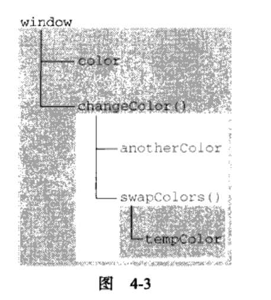

## 4.2执行环境及作用域

#### 执行环境（为简单起见，有时也称为“环境”）是javaScript中最为重要的一个概念。执行环境定义了变量或函数有权访问的其他数据。决定了他们各自的行为。每个执行环境都有一个与之关联的变量对象（variable object）。环境中定义的所有变量和函数都保存在这个对象中。虽然我们编写的代码无法访问这个对象。但解析器在处理数据时会在后台使用它。

#### 全局执行环境是最外围的一个执行对象。根据ECMAScript实现所在的宿主环境不同。表示执行环境的对象也不一样。在web浏览器中。全局执行环境被认为是window对象。因此所有全局变量和函数都是作为window对象的属性和方法创建的。某个执行环境中的所有代码执行完毕后。该环境被销毁。

#### 每个函数都有自己的执行环境。当执行流进入一个函数时。函数的环境就会被推入一个环境栈中。而在函数执行后。栈将其环境弹出。把控制权返回给之前的执行环境。

#### `当代码在一个环境中执行时。会创建变量对象的一个作用域链。作用域链的用途，是保证对执行环境有权访问的所有变量和函数的有序访问。作用域的前端，始终都是当前执行的代码所在环境的变量对象。如果这个环境是函数，则其活动对象作为变量对象。活动对象在最开始时只包含一个变量，即arguments对象。作用域链中的下一个变量对象来自（外部）环境。而再一个变量对象则来自。而再下一个变量对象则来自下一个包含环境。这样，一直延续到全局执行环境。全部执行环境的对象始终是作用域链中的最后一个对象`
```
var color = "blue";
function changeColor(){
    if(color === "bule"){
        color = "red";
    }else{
        color = "blue";
    }
    console.log(color)
}
changeColor();  //red
alert(color);   //red
调用changeColor(),在changeColor作用域里找，没找到color。一直沿着作用域链找。找到color = blue。
```
#### 此外，在局部作用域中定义的变量可以在局部环境中与全局变量互换使用，如下面栗子所示：
```
var color = "blue";
function changeColor(){
    var anontherColor = "red";
    
    function swapColors(){
        var tempColor = anontherColor;
        anontherColor = color;
        color = tempColor;

        //这里可以访问color,anontherColor和tempColor
    }
    //这里可以访问color和anontherColor，但不能访问tempColor
    swapColors();
}
//这里只能访问color
changeColor();
```

#### 以上代码总共涉及3个执行环境：全局环境，changeColor()的局部环境和swapColors()的局部环境。全局环境中有一个变量color和一个函数changeColor()。changeColor()的局部环境中有一个名为anontherColor的变量和一个名为swapColors()的函数。但它也可以访问全局环境中的变量color。swapColors()的局部环境中有一个变量tempColor。该变量只能在这个环境中才能访问到。无论全局环境还是changeColor()的局部环境都无权访问tempColor。然而，在swapColors()内部则可以访问其他两个环境中的所有变量。因为那两个环境是它的父执行环境。


----

### 4.2.1延长作用域链

#### 虽然执行环境的类型总共有两种——全局和局部（函数），但还是有其他办法来延长作用域。这么说是因为有些语句可以在作用域链的前端临时增加一个变量对象。该变量对象会在代码执行后被移除。在两种情况下会发生这种现象。具体来说，就是当执行流进入下列任何一个语句时。作用域链就会得到加长。
* try-catch语句的catch块。
* with语句。
#### 这两个语句都会在作用域链的前端添加一个变量对象。对with语句来说。会将制定的对象添加到作用域中。对catch语句来说。会创建一个新的变量对象。其中包含的是抛出的错误对象的声明。
#### 栗子
```
function buildUrl(){
    var qs = "?debug = true";
    with(location){
        var url = href + qs;
    }
    return url;
}
```
#### 为此，with语句接收的是location对象，因此其变量对象包含了location对象的所有属性和方法。而这个变量对象被添加到了作用域链的前端。buildUrl()函数中定义了变量qs。当在with语句中引用变量href时。（实际引用的是location.href）,可以在当前执行环境的变量对象中找到。当引用变量qs时。引用的则是在buildUrl（）中定义的那个变量。而该变量位于函数环境的变量对象中，至于with语句内部，则定义了一个名为url的变量。而该变量位于函数环境的变量对象中。至于with语句内部，则定义了一个名为url的变量。因而url就成了函数执行环境的一部分。所以可以作为函数的值被返回。

---- 
### 4.2.2 没有块级作用域
#### JavaScript`没有块级作用域经常回到导致理解上的困惑`。在其他类c语言中，由花括号封闭的代码块都有自己的作用域。（如果用ECMAScript的话来讲，就是他们自己的执行环境）。因而支持根据条件来定义变量。
```
if(true){
    var color = "blue";
}
alert(color);   //"blue"
```
#### 这里在一个if语句中定义了变量color。如果是在C,C++或者是java中。color会在if语句执行后销毁。但在JavaScript中。if语句中的变量声明会将变量添加到当前的执行环境中。在使用`for语句`时尤其要牢记这一差异。
```
for(var i = 0;i < 10;i++){
    doSomenthing(i);
}
alert(i);   //10
```
#### 对于块级作用域的语言来说。for语句初始化变量的表达式所定义的变量。只会存在于循环的环境之中。而对于javaScript来说。由for语句创建的变量i即使在for循环结束后，也依旧会存在于循环外部的执行环境中。


#### 1.声明变量
#### 使用 `var` 声明的变量会自动被添加到最接近的环境中。在函数内部。最接近的环境就是函数的局部环境。在 `with` 语句中。最接近的环境是函数环境。如果初始化变量时没有使用var声明。该变量会自动被添加到全局环境。
```
function add(num1,num2){
    var sum = num1 + num2;
    return sum;
}
var result = add(10,20);    //30
alert(sum);                 //由于sum不是有效的变量。因此会导致错误
```
#### 以上代码中的函数add（）定义了一个名为sum的局部变量，该变量包含加法操作的结果。虽然结果值从函数返回了。但变量sum在函数外部是访问不到的。如果省略这个 `var`关键字。那么当add（）执行完毕后，sum也将可以访问到：
```
function add(num1 ,num2){
    sum = num1 + num2;
    return sum;
}
var result = add(10, 20);   //30
alert(sum);                 //30
```
#### 这个例子中的变量sum在被初始话赋值时没有使用var 关键字。于是，当调用完add()之后，添加到全局环境中的变量sum将继续存在；即使函数已经执行完毕，后面的代码依旧可以访问它。

#### 2.查询标识符
#### 当在某个环境中为了读取或写入而引用一个标识符时。必须通过搜索来确定该标识符实际代表什么
#### 例子
```
var color = "blue";
function getColor(){
    return color;
}
alert(getColor());  //"blue"
```
#### 调用本栗中的函数getColor()时会引用变量color。为了确定变量color的值，将开始一个两部的搜索过程。首先，搜索getColor（）变量对象。查找其中是否包含一个名为color的标识符。在没有找到的情况下，搜索继续到下一个变量对象（全局环境的变量对象）。然后再那里找到名为color的标识符。